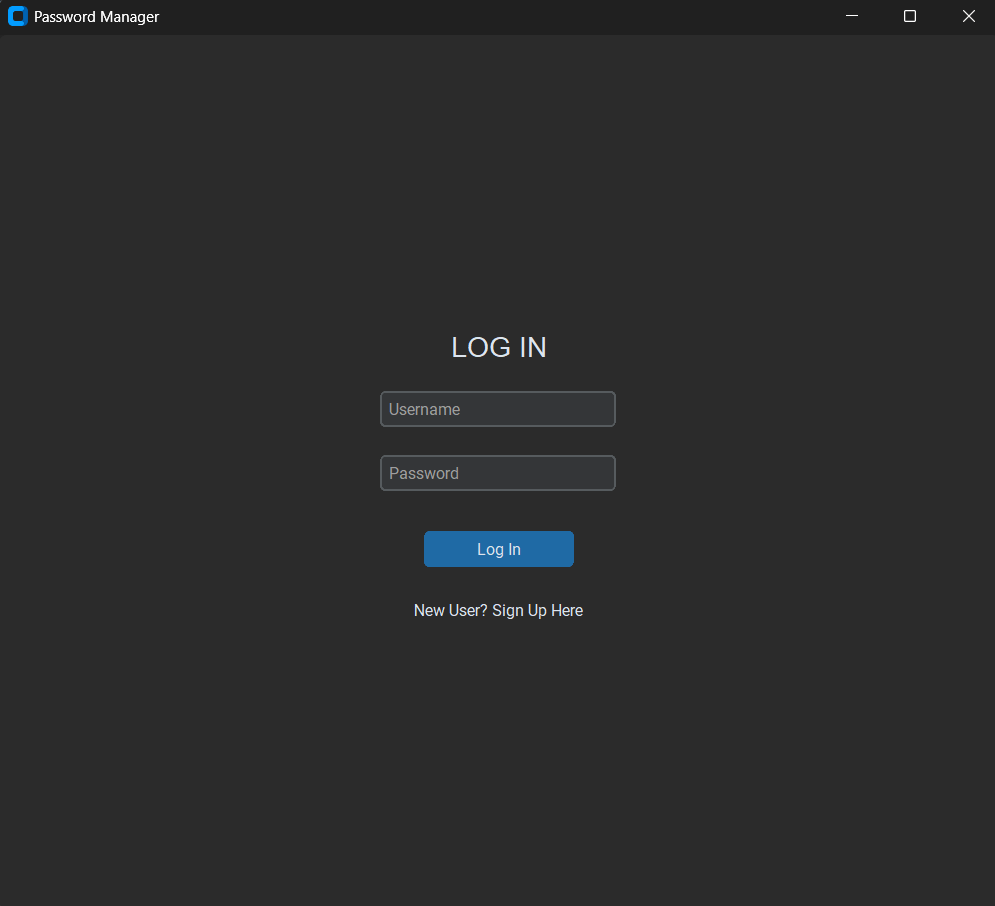
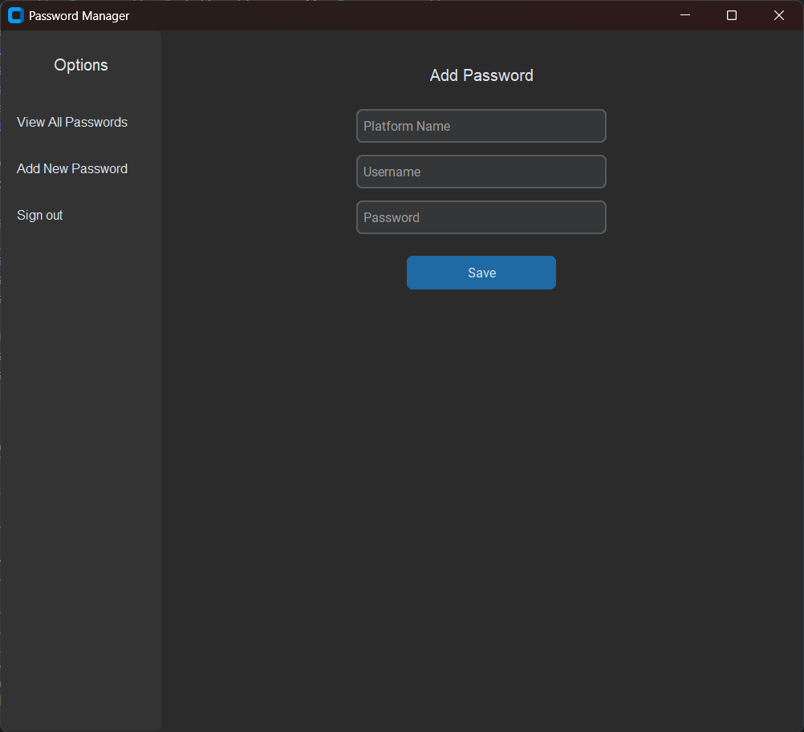
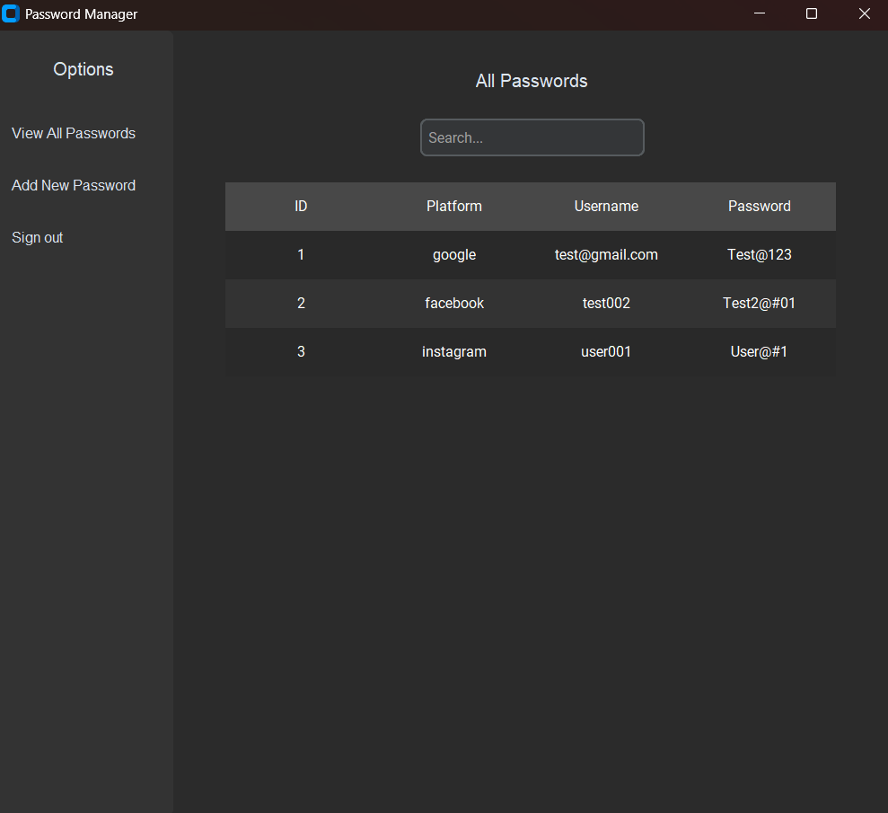
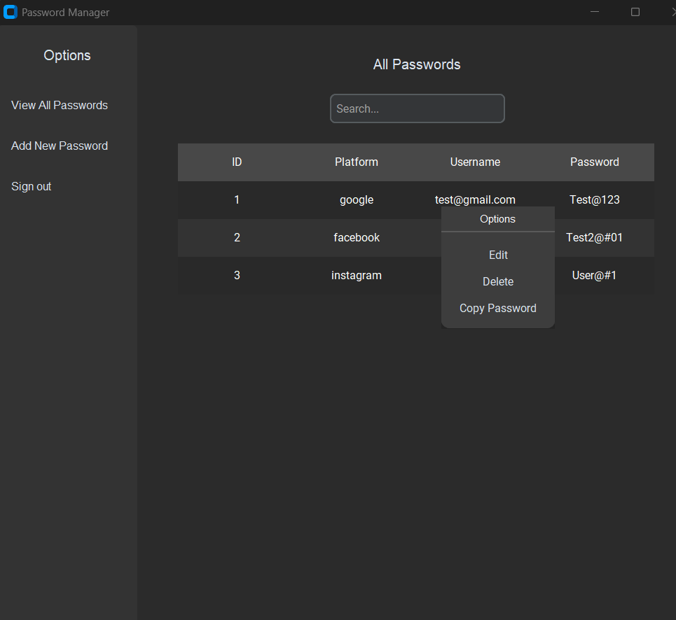
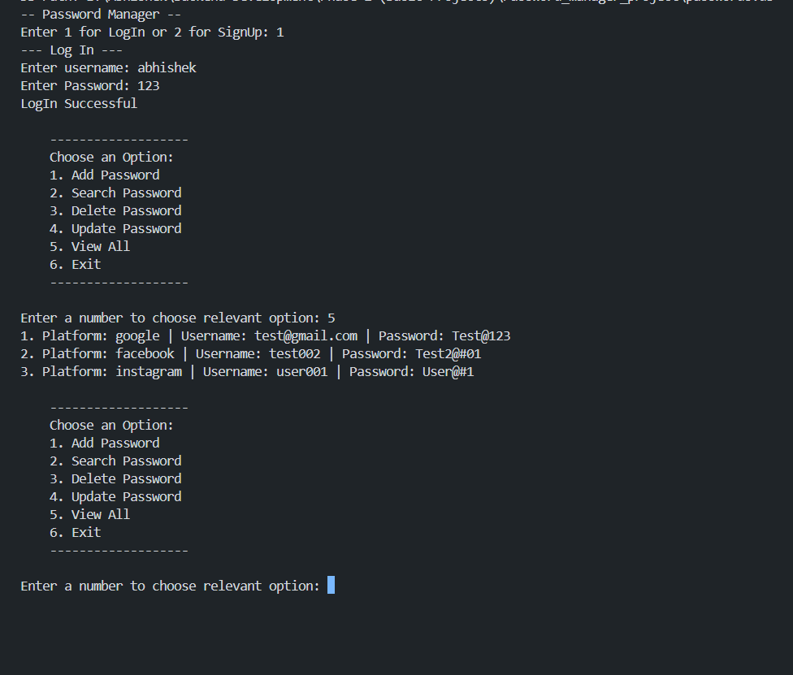

# Password Manager

A desktop-based Password Manager application built with Python and CustomTkinter.

> 🚧 **Originally built in 2025 as a Python learning project.** This project represents my early exploration of Python, Object-Oriented Programming, authentication, encryption, REST APIs, and GUI development.

The application allows users to create an account, manage saved credentials, search passwords, and perform password management operations through both a Command Line Interface (CLI) and a graphical user interface.

---

## Features

- User Sign Up and Login
- Desktop GUI built with CustomTkinter
- Command Line Interface (CLI)
- Add new passwords and credentials
- View all saved passwords
- Search passwords
- Update saved passwords
- Delete passwords
- Copy passwords
- Password encryption using Fernet
- Authentication password hashing using bcrypt
- Random password generation using Python's `secrets` module
- REST API communication using `requests`

---

# Screenshots

## Login Screen

<p align="center">
  
</p>

## Add Password

<p align="center">
  
</p>

## View All Passwords

<p align="center">
  
</p>

## Password Options

<p align="center">
  
</p>

## CLI Version

<p align="center">
  
</p>

---

# Technologies Used

- Python
- CustomTkinter
- bcrypt
- cryptography (Fernet)
- requests
- JSON

---

# Project Structure

```text
password-manager/
│
├── authentication/
│   ├── authentication.py
│   ├── login.py
│   └── signup.py
│
├── gui/
│   ├── app.py
│   └── dashboard_layout/
│       ├── add_password.py
│       ├── dashboard_layout.py
│       ├── popup.py
│       ├── update_dialog.py
│       └── view_all.py
│
├── password_manager/
│   ├── server_handling/
│   ├── encrypt.py
│   ├── manager.py
│   └── password_generator.py
│
├── utils/
│   └── input_utils.py
│
├── screenshots/
│
├── main.py
├── requirements.txt
├── .gitignore
└── README.md
```

---

# How It Works

### Authentication

User authentication passwords are hashed using `bcrypt`.

### Password Encryption

Saved passwords are encrypted using Fernet symmetric encryption from Python's `cryptography` library.

### Password Generation

The application uses Python's `secrets` module to generate random passwords.

### Password Management

Users can:

- Add credentials
- Search credentials
- View all credentials
- Update credentials
- Delete credentials
- Copy passwords

The application communicates with the backend using HTTP requests.

---

# Installation

## 1. Clone the Repository

```bash
git clone https://github.com/py-abhishek/password-manager.git
cd password-manager
```

## 2. Create a Virtual Environment

```bash
python -m venv .venv
```

## 3. Activate the Virtual Environment

### Windows

```bash
.venv\Scripts\activate
```

### Linux / macOS

```bash
source .venv/bin/activate
```

## 4. Install Dependencies

```bash
pip install -r requirements.txt
```

## 5. Run the Application

For the GUI version:

```bash
python -m gui.app
```

For the CLI version:

```bash
python main.py
```

---

# Concepts Practiced

This project was built while learning and practicing:

- Object-Oriented Programming (OOP)
- Classes and Inheritance
- Python Modules and Packages
- GUI Development
- Password Hashing
- Encryption and Decryption
- Secure Random Password Generation
- REST API Communication
- CRUD Operations
- JSON and File Handling
- User Input Validation

---

# Security Note

This project was created primarily for learning and portfolio purposes and should not be considered a production-ready password manager.

If developed further, improvements could include:

- Environment variable configuration
- Secure secret/key management
- Complete GUI authentication integration
- API authentication and authorization
- Session management
- Improved error handling and logging
- Unit and integration tests
- Database-level security

---

# Future Improvements

- [ ] Complete GUI authentication integration
- [ ] Add password visibility toggle
- [ ] Add password strength indicator
- [ ] Add copy confirmation notifications
- [ ] Improve API error handling
- [ ] Add environment variable configuration
- [ ] Add unit tests
- [ ] Improve secret key management
- [ ] Package the application as an executable

---

# Author

**Abhishek Chaudhary**

GitHub: https://github.com/py-abhishek
